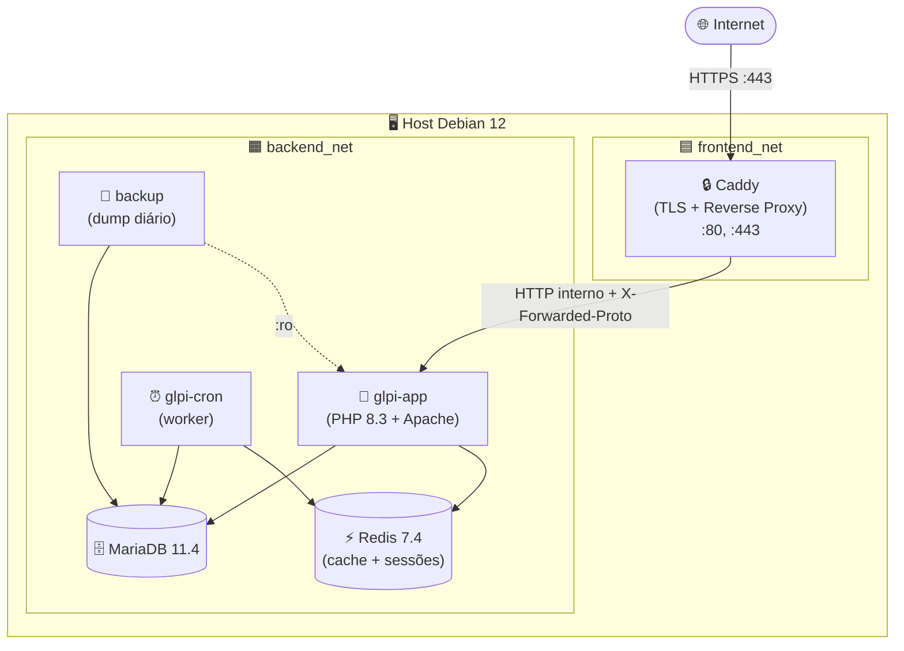

<div align="center">

# 🖥️ GLPI 11 — Production Stack

**Stack production-grade do GLPI 11 dockerizada em Debian 12 — TLS automático, Redis, worker dedicado de cron e backup agendado com restore testado.**


</div>

---

## 📋 Sobre o Projeto

Implantação **production-ready** do GLPI 11 (Gestionnaire Libre de Parc Informatique) com 6 containers Docker orquestrados por Docker Compose. Cada container tem responsabilidade única, healthcheck, restart policy e hardening de segurança aplicado.

| Princípio | Implementação |
|:---|:---|
| **Imutabilidade** | Versões pinadas em todas as imagens — nunca `:latest` |
| **Single Responsibility** | 1 serviço = 1 container (app, cron, db, cache, proxy, backup) |
| **Defesa em profundidade** | Redes segregadas, `cap_drop: ALL`, secrets via `.env` |
| **Resiliência** | Healthchecks com `start_period` adequado, `restart: unless-stopped` |
| **Observabilidade** | Logs JSON estruturados (prontos para Loki na Fase 2) |

---

## 🏗️ Arquitetura

### Diagrama



### Containers

| Serviço | Imagem | Função | Portas (host) |
|:---|:---|:---|:---|
| `caddy` | `caddy:2.8-alpine` | Reverse proxy + TLS automático (Let's Encrypt) | `80`, `443`, `443/udp` |
| `glpi-app` | `glpi/glpi:11.0.7` | Aplicação web GLPI | — (interno) |
| `glpi-cron` | `glpi/glpi:11.0.7` | Worker dedicado de tarefas agendadas | — (interno) |
| `mariadb` | `mariadb:11.4` | Banco de dados | — (interno) |
| `redis` | `redis:7.4-alpine` | Cache e sessões PHP | — (interno) |
| `backup` | `${projeto}/backup:1.0` | Dump diário do banco + arquivos | — (interno) |

---

## 🧠 Justificativa das Decisões Técnicas

### ADR-001 — Worker de cron em container dedicado (`glpi-cron`)

O GLPI possui um sistema de tarefas agendadas (alertas, automações, sincronizações LDAP). Em vez de ativar o cron dentro do `glpi-app`, criamos um container dedicado com `GLPI_CRONTAB_ENABLED=true` enquanto o app mantém `false`. Isso permite futura escala horizontal do `glpi-app` (N réplicas atrás de load balancer) sem o risco de jobs duplicados sendo executados em cada réplica ao mesmo tempo.

### ADR-002 — Endpoint `/health` estático como healthcheck do Apache

O GLPI 11 implementa `SessionCheckCookieListener`: qualquer requisição HTTP é rejeitada com `400 Bad Request` quando `session.cookie_secure=1` está ativo — uma proteção legítima contra cookies de sessão em canais não cifrados. O healthcheck do container não pode usar HTTPS direto (o TLS fica no Caddy). A solução: um arquivo estático em `/var/www/glpi/public/health` montado via volume. O Apache já tem `RewriteCond %{REQUEST_FILENAME} !-f` — arquivos existentes são servidos diretamente sem passar pelo PHP, evitando a validação do GLPI.

### ADR-003 — `SetEnvIf X-Forwarded-Proto "^https$" HTTPS=on`

Caddy faz TLS termination e repassa HTTP interno para o `glpi-app`. O Symfony (base do GLPI 11) determina se a requisição é segura via `$request->isSecure()`, que verifica `$_SERVER['HTTPS']`. Sem configuração, Apache não traduz o header `X-Forwarded-Proto: https` para essa variável, e o GLPI rejeita todas as requisições do browser com o erro de cookie seguro. A diretiva `SetEnvIf` do `mod_setenvif` (já habilitado na imagem oficial) resolve isso sem modificar a imagem — apenas um arquivo de config montado via volume.

### ADR-004 — GID bridge no container de backup (Alpine ≠ Debian)

O container GLPI roda em Debian com `www-data` GID 33. O container de backup usa Alpine 3.20, onde `www-data` tem GID 82. Os arquivos OAuth do GLPI (`oauth.pem`, `oauth.pub`) têm permissão `660` — legíveis apenas pelo dono ou grupo 33. Sem intervenção, o `tar` falha silenciosamente nesses arquivos. A solução: criar no Dockerfile Alpine um grupo `glpi-www` com GID 33 explícito e adicionar o usuário `backup` a ele. A checagem de permissão do kernel usa o número do GID, não o nome — o bridge funciona de forma transparente.

---

## ✅ Pré-requisitos

### Host

- **SO:** Debian 12 (Bookworm) — outras distros funcionam, testado em Ubuntu 22.04+
- **CPU:** mínimo 2 vCPUs
- **RAM:** mínimo 4 GB
- **Disco:** 20 GB livres
- **Rede:** portas 80 e 443 acessíveis publicamente (Let's Encrypt precisa)

### Software

```bash
# Docker Engine + Compose v2 (oficial Debian)
# https://docs.docker.com/engine/install/debian/
docker --version          # >= 24.x
docker compose version    # >= v2.20
```

### DNS

Aponte um registro `A` do seu domínio para o IP público do host **antes** de subir a stack. O Let's Encrypt falhará se o DNS não estiver propagado no momento do bootstrap.

```
glpi.exemplo.com.br.   IN  A   203.0.113.42
```

> **Teste local:** use `GLPI_DOMAIN=glpi.localhost` — o Caddy emite certificado interno automaticamente, sem DNS externo.

---

## 🚀 Instalação

```bash
# 1. Clone o projeto
git clone https://github.com/nilo-lima/glpi-docker-stack.git
cd glpi-docker-stack/fase_01_glpi_mariadb_caddy

# 2. Bootstrap (cria .env, valida dependências e sobe a stack)
chmod +x scripts/*.sh services/backup/scripts/*.sh
./scripts/bootstrap.sh

# 3. Aguarde a primeira inicialização (2–5 min — instala o banco)
docker compose logs -f glpi-app

# 4. Acesse https://seu-dominio.com.br
#    Login inicial: glpi / glpi   ← TROQUE IMEDIATAMENTE

# 5. Pós-instalação
./scripts/enable-timezones.sh
./scripts/configure-redis-cache.sh

# 6. Desativar autoinstalação após primeiro boot OK
#    Edite .env: GLPI_SKIP_AUTOINSTALL=true
#    docker compose up -d glpi-app
```

### Hardening pós-instalação

Dentro do GLPI, em **Administração → Usuários**:
1. Trocar senha do usuário `glpi` (admin)
2. Desativar ou trocar senhas de `tech`, `normal`, `post-only`

---

## 🔐 Variáveis de Ambiente

Veja `.env.example` para a lista completa documentada. Valores com caracteres especiais (`@`, `#`, `$`) **devem estar entre aspas duplas**.

| Variável | Descrição | Obrigatória |
|:---|:---|:---|
| `GLPI_DOMAIN` | FQDN público (ex: `glpi.exemplo.com.br`) | ✅ |
| `ACME_EMAIL` | E-mail para notificações do Let's Encrypt | ✅ |
| `MARIADB_ROOT_PASSWORD` | Senha root do banco | ✅ |
| `MARIADB_PASSWORD` | Senha do usuário `glpi` no banco | ✅ |
| `REDIS_PASSWORD` | Senha do Redis | ✅ |
| `BACKUP_CRON_SCHEDULE` | Schedule do backup (default: `"0 3 * * *"`) | ⚠️ |
| `BACKUP_RETENTION_DAYS` | Dias de retenção (default: `14`) | ⚠️ |
| `TZ` | Timezone (default: `America/Sao_Paulo`) | ⚠️ |

```bash
# Gerar senhas fortes
openssl rand -base64 32
```

---

## 🔧 Operação

```bash
# Status e saúde
docker compose ps
./scripts/healthcheck-all.sh

# Logs
docker compose logs -f
docker compose logs -f glpi-app caddy

# Reiniciar serviço
docker compose restart glpi-app

# Atualizar versão (editar GLPI_IMAGE_TAG no .env primeiro)
docker compose pull && docker compose up -d

# Parar sem destruir dados
docker compose stop

# Destruir stack (preserva volumes)
docker compose down

# Destruir tudo incluindo volumes
docker compose down -v
```

### Console GLPI (CLI)

```bash
# Status do sistema
docker compose exec glpi-app /var/www/glpi/bin/console glpi:system:status

# Limpar cache
docker compose exec glpi-app /var/www/glpi/bin/console cache:clear

# Listar todos os comandos
docker compose exec glpi-app /var/www/glpi/bin/console list
```

---

## 💾 Backup e Restore

### Backup automático

- **Schedule:** `BACKUP_CRON_SCHEDULE` (default: 03:00 diário)
- **Conteúdo:** dump SQL (`--single-transaction`) + tar dos arquivos persistentes
- **Localização:** `./backups/` no host
- **Retenção:** `BACKUP_RETENTION_DAYS` dias

```bash
# Backup manual imediato
./scripts/backup-now.sh
```

### Restore interativo

```bash
./scripts/restore.sh
# Lista backups disponíveis, detecta o tar de arquivos correspondente,
# para o GLPI, restaura banco + arquivos, reinicia e limpa cache.
```

### Off-site (recomendado)

```bash
# No crontab do HOST — sincronizar após o backup das 03:00
0 4 * * * rclone sync /opt/glpi/backups/ s3:meu-bucket-glpi/ --transfers=4
```

---

## 🛠️ Troubleshooting

### Caddy não obtém certificado TLS

```
ERR getting certificate ... DNS problem
```

- Confirme que o DNS aponta para o IP correto: `dig +short glpi.exemplo.com.br`
- Verifique se portas 80 e 443 estão abertas no firewall e no provedor de cloud
- `docker compose logs caddy | tail -50`

### `glpi-app` unhealthy após bootstrap

- Na **primeira** inicialização o GLPI instala o banco (~2–5 min) — o `start_period` é 120s, aguarde
- `docker compose logs -f glpi-app`
- Se persistir: `docker compose exec glpi-app ping mariadb` para testar conectividade

### "Database connection failed"

- Senha errada no `.env` → corrija e `docker compose up -d --force-recreate glpi-app`
- Banco não subiu → `docker compose logs mariadb`

### Logout aleatório / sessões perdidas

- Redis inacessível → `docker compose exec glpi-app redis-cli -h redis -a "$REDIS_PASSWORD" ping`
- Confirme que `REDIS_PASSWORD` está declarado no `environment:` do `glpi-app` no compose

### Espaço em disco crescendo

```bash
docker compose exec glpi-app /var/www/glpi/bin/console cache:clear
docker image prune -f
ls -lh backups/    # remover backups antigos manualmente se necessário
```

---

## 📋 Comandos Úteis

```bash
# Shell nos containers
docker compose exec glpi-app bash
docker compose exec mariadb mariadb -u glpi -p"$MARIADB_PASSWORD" glpi
docker compose exec redis redis-cli -a "$REDIS_PASSWORD"

# Inspecionar redes e volumes
docker network inspect glpi-prod_backend
docker volume inspect glpi-prod_glpi_data
docker system df -v | grep glpi-prod

# Validar compose antes de aplicar
docker compose config

# Acompanhar healthchecks em tempo real
watch -n 5 'docker compose ps'
```

---

## ✅ Boas Práticas Aplicadas

- ✅ Versões pinadas em todas as imagens (jamais `:latest`)
- ✅ 1 serviço = 1 container (Single Responsibility)
- ✅ Cron isolado do front-end (escalabilidade horizontal futura)
- ✅ Redes segregadas (`frontend` ≠ `backend`)
- ✅ Banco e Redis sem porta exposta no host
- ✅ `cap_drop: ALL` + `cap_add` mínimo em todos os containers
- ✅ `no-new-privileges:true` em todos os containers
- ✅ `read_only: true` + `tmpfs` no Redis
- ✅ Healthchecks em todos os serviços com `start_period` adequado
- ✅ `restart: unless-stopped` em todos os serviços
- ✅ Volumes nomeados (Docker gerencia permissões)
- ✅ Logs JSON com rotação (`max-size: 10m`, `max-file: 5`)
- ✅ Limites de memória explícitos em todos os containers
- ✅ Headers de segurança no Caddy (HSTS, X-Frame-Options, etc.)
- ✅ TLS 1.2+ automático com renovação via Let's Encrypt
- ✅ HTTP/3 (QUIC) habilitado
- ✅ Backup com `--single-transaction` (consistência sem locks em InnoDB)
- ✅ Verificação de integridade gzip pós-dump
- ✅ Senhas via `.env` com `chmod 600` e `.gitignore` blindado
- ✅ Comandos perigosos do Redis desabilitados (`FLUSHDB`, `FLUSHALL`)
- ✅ OPcache + JIT habilitados para performance em produção
- ✅ Sessões PHP no Redis com locking (anti-corrupção sob concorrência)

---

## 🎓 Lições Aprendidas

Este projeto foi validado com um destroy + recreate completo. Durante o bootstrap inicial, 9 problemas reais foram identificados e corrigidos — documentados aqui por serem recorrentes em stacks similares.

**Aspas em variáveis de ambiente com caracteres especiais são obrigatórias.** `BACKUP_CRON_SCHEDULE=0 3 * * *` sem aspas faz o bash interpretar `3` como um comando ao fazer `source .env`. Senhas com `@`, `#` ou `$` têm o mesmo problema. A regra: qualquer valor com espaço ou caractere especial no `.env` precisa de aspas duplas.

**Variáveis de ambiente precisam ser declaradas explicitamente no `environment:` do compose.** O PHP expande `${REDIS_PASSWORD}` no `php.ini`, mas a variável só existe no container se for declarada. Sem `REDIS_PASSWORD: ${REDIS_PASSWORD}` no compose, o PHP recebia string vazia, e o Redis recusava a conexão.

**GLPI 11 rejeita HTTP por design quando `session.cookie_secure=1`.** O `SessionCheckCookieListener` do Symfony retorna `400 Bad Request` para qualquer requisição sem HTTPS — mesmo healthchecks internos. Solução: arquivo estático no doc root do Apache, servido diretamente sem passar por PHP.

**Caddy faz TLS termination; o Apache interno não sabe que a requisição veio por HTTPS.** `$request->isSecure()` retorna false sem `SetEnvIf X-Forwarded-Proto "^https$" HTTPS=on` no Apache. Uma linha de config montada via volume resolve sem modificar a imagem oficial.

**Alpine Linux e Debian têm GIDs diferentes para `www-data` (82 vs 33).** O container de backup (Alpine) tentava ler arquivos com permissão `660` pertencentes ao GID 33 do GLPI (Debian). A solução foi criar um grupo com GID 33 no Dockerfile Alpine — o kernel verifica o número do GID, não o nome.

**DSNs de URL não aceitam `@` e `#` literais.** `redis://:Senha@#@host/db` quebra o parser de URL porque `@` é separador de credenciais e `#` é fragmento. A senha precisa de URL-encoding (`urllib.parse.quote`) antes de ser inserida em qualquer DSN.

---

## 🗺️ Roadmap

### Fase 1 — Production Stack ✅
Stack base com 6 containers, TLS automático, backup agendado com restore testado.

### Fase 2 — Observabilidade
Prometheus + Grafana (dashboards GLPI/MariaDB/Redis) + Loki + Promtail + Alertmanager.

### Fase 3 — AWS com Terraform
VPC, EC2, Security Groups, S3 para backups off-site, ACM para TLS gerenciado.

### Fase 4 — Melhorias
CrowdSec (WAF/anti-bruteforce), CI/CD com GitHub Actions, Helm chart para Kubernetes.

---

## 💖 Apoie este Projeto

Se este projeto foi útil para você:
- ⭐ Deixe uma estrela no repositório
- 🐛 Abra uma issue com sugestões ou bugs
- 🤝 Contribua com um pull request — veja [CONTRIBUTING.md](CONTRIBUTING.md) para as convenções do projeto

---

## ⚖️ Licença

Distribuído sob a licença **MIT**. Veja [LICENSE](LICENSE) para mais informações.

GLPI é distribuído sob **GPL-3.0** — ver [glpi-project.org](https://www.glpi-project.org).

---

<div align="center">
  <sub>
    Parte do
    <a href="https://github.com/nilo-lima/glpi-docker-stack">glpi-docker-stack</a>
    · Fase 1 de 4
  </sub>
</div>
