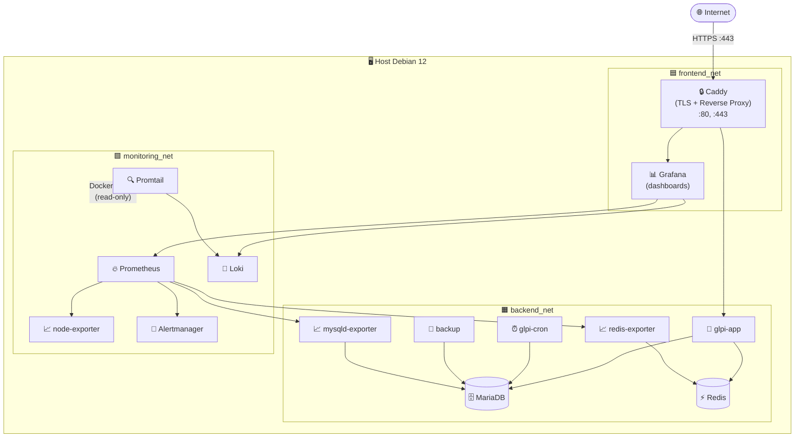

<div align="center">

# 📊 GLPI 11 - Observabilidade (Fase 2)

**Stack unificada de 14 containers: GLPI completo + Prometheus, Grafana, Loki, Promtail e Alertmanager - métricas, dashboards e logs centralizados em um único `docker compose up`.**


</div>

---

## 📋 Sobre

A Fase 2 estende a Fase 1 com **observabilidade completa**: coleta de métricas via Prometheus, dashboards no Grafana, logs centralizados com Loki + Promtail e alertas via Alertmanager. A stack é **auto-suficiente** - inclui todos os serviços GLPI da Fase 1 mais os 8 novos serviços de monitoramento.

| Componente | Função |
|:---|:---|
| **Prometheus** | Coleta e armazena métricas em série temporal |
| **node-exporter** | Métricas do host (CPU, RAM, disco, rede) |
| **mysqld-exporter** | Métricas do MariaDB (queries, conexões, InnoDB) |
| **redis-exporter** | Métricas do Redis (memória, hits, comandos) |
| **Grafana** | Dashboards interativos e exploração de dados |
| **Loki** | Agregação e armazenamento de logs |
| **Promtail** | Coleta logs de todos os containers via Docker socket |
| **Alertmanager** | Roteamento de alertas (receptor configurável) |

---

## 🏗️ Arquitetura



### Redes

| Rede | Membros | Finalidade |
|:---|:---|:---|
| `frontend_net` | caddy, glpi-app, grafana | Borda TLS → aplicação |
| `backend_net` | glpi-app, glpi-cron, mariadb, redis, backup, mysqld-exporter, redis-exporter | Dados e monitoramento de banco/cache |
| `monitoring_net` | prometheus, node-exporter, mysqld-exporter, redis-exporter, grafana, loki, promtail, alertmanager | Coleta e visualização de observabilidade |

### Containers

| Serviço | Imagem | Portas (host) |
|:---|:---|:---|
| `caddy` | `caddy:2.8-alpine` | `80`, `443`, `443/udp` |
| `glpi-app` | `glpi/glpi:11.0.7` | - |
| `glpi-cron` | `glpi/glpi:11.0.7` | - |
| `mariadb` | `mariadb:11.4` | - |
| `redis` | `redis:7.4-alpine` | - |
| `backup` | `glpi-dev/backup:1.0` | - |
| `prometheus` | `prom/prometheus:v2.55.1` | - |
| `node-exporter` | `prom/node-exporter:v1.8.2` | - |
| `mysqld-exporter` | `prom/mysqld-exporter:v0.16.0` | - |
| `redis-exporter` | `oliver006/redis_exporter:v1.66.0` | - |
| `grafana` | `grafana/grafana:11.4.0` | - |
| `loki` | `grafana/loki:3.3.2` | - |
| `promtail` | `grafana/promtail:3.3.2` | - |
| `alertmanager` | `prom/alertmanager:v0.27.0` | - |

> Nenhuma porta de banco, cache ou monitoramento é exposta no host. Grafana é acessado exclusivamente via Caddy com TLS.

---

## ✅ Pré-requisitos

- Stack da Fase 1 **não precisa estar rodando** - esta fase é auto-suficiente
- Docker Engine >= 24.x e Docker Compose v2 >= 2.20
- Portas `80` e `443` disponíveis no host
- DNS apontando para o host (ou use `.localhost` para testes locais)

```bash
docker --version
docker compose version
```

---

## 🚀 Instalação

```bash
cd fase_02_Observabilidade

# 1. Copie e preencha o .env
cp .env.example .env
chmod 600 .env
# Edite .env: defina domínios, senhas e email

# 2. Suba o MariaDB primeiro e configure o usuário de monitoramento
docker compose up -d mariadb
./scripts/setup-monitoring-user.sh

# 3. Suba a stack completa
docker compose up -d

# 4. Aguarde todos os containers ficarem healthy (~2-5 min)
docker compose ps

# 5. Verifique a saúde de todos os serviços
./scripts/healthcheck-all.sh
```

### Acesso

| Serviço | URL |
|:---|:---|
| GLPI | `https://${GLPI_DOMAIN}` |
| Grafana | `https://${GRAFANA_DOMAIN}` |

Login GLPI inicial: `glpi` / `glpi` - **troque imediatamente.**
Login Grafana: `admin` / `${GRAFANA_ADMIN_PASSWORD}`

### Pós-instalação (uma vez)

```bash
# Após o GLPI concluir a instalação automática:
./scripts/enable-timezones.sh
./scripts/configure-redis-cache.sh

# Trave o autoinstall no .env:
# GLPI_SKIP_AUTOINSTALL=true
# docker compose up -d glpi-app glpi-cron
```

---

## 🔐 Variáveis de Ambiente

Veja `.env.example` para a lista completa com comentários. Valores com `@`, `#` ou `$` **devem estar entre aspas duplas**.

| Variável | Descrição | Obrigatória |
|:---|:---|:---|
| `GLPI_DOMAIN` | FQDN do GLPI (ex: `glpi.exemplo.com.br`) | ✅ |
| `GRAFANA_DOMAIN` | FQDN do Grafana (ex: `grafana.glpi.exemplo.com.br`) | ✅ |
| `ACME_EMAIL` | E-mail para Let's Encrypt | ✅ |
| `MARIADB_ROOT_PASSWORD` | Senha root do banco | ✅ |
| `MARIADB_PASSWORD` | Senha do usuário `glpi` | ✅ |
| `REDIS_PASSWORD` | Senha do Redis | ✅ |
| `GRAFANA_ADMIN_PASSWORD` | Senha admin do Grafana | ✅ |
| `GRAFANA_SECRET_KEY` | Chave de assinatura de sessões do Grafana | ✅ |
| `MARIADB_MONITORING_PASSWORD` | Senha do usuário `monitoring` (sem `@` ou `/`) | ✅ |
| `PROMETHEUS_RETENTION` | Retenção de métricas (default: `30d`) | ⚠️ |

```bash
# Gerar senhas fortes
openssl rand -base64 32

# Senha do monitoring (sem caracteres especiais de URL)
openssl rand -base64 18 | tr -d '@/+'
```

---

## 📊 Dashboards Grafana

Quatro dashboards são provisionados automaticamente na pasta **GLPI Production**:

| Dashboard | ID | O que monitora |
|:---|:---|:---|
| Node Exporter Full | 1860 | CPU, RAM, disco, rede, carga do host |
| MySQL Overview | 14057 | Queries/s, conexões, InnoDB, slow queries |
| Redis Dashboard | 14091 | Memória, hit ratio, comandos, latência |
| Logs / App | 13639 | Logs centralizados por serviço (Loki) |

Para explorar logs diretamente: **Explore → Logs (Loki)**
```logql
{job="glpi-app"}
{job="caddy"}
{job=~"mariadb|redis"}
```

---

## 🔔 Alertas

O Alertmanager está configurado como **stub** (blackhole) - os alertas são gerados mas descartados. Para configurar notificações reais, edite `services/alertmanager/config/alertmanager.yml` e adicione um receiver (e-mail, Slack, PagerDuty, etc.).

Alertas pré-configurados no Prometheus:

| Alerta | Condição | Severidade |
|:---|:---|:---|
| `TargetDown` | Exporter inacessível | critical |
| `HighDiskUsage` | Disco > 80% | warning |
| `CriticalDiskUsage` | Disco > 95% | critical |
| `LowMemory` | Memória disponível < 10% | warning |
| `HighLoadAverage` | Load > 2× CPUs por 5 min | warning |
| `MariaDBDown` | mysqld-exporter sem resposta | critical |
| `MariaDBHighConnections` | Conexões > 80% do max | warning |
| `MariaDBSlowQueries` | Slow queries > 1/s | warning |
| `RedisDown` | redis-exporter sem resposta | critical |
| `RedisHighMemory` | Memória Redis > 90% | warning |
| `RedisRejectedConnections` | Conexões rejeitadas > 0 | warning |

---

## 🔧 Operação

```bash
# Status
docker compose ps
./scripts/healthcheck-all.sh

# Logs
docker compose logs -f
docker compose logs -f prometheus grafana

# Backup manual
./scripts/backup-now.sh

# Reiniciar serviço específico
docker compose restart grafana

# Atualizar versão de imagem (editar tag no .env primeiro)
docker compose pull prometheus
docker compose up -d --no-deps prometheus

# Parar sem destruir dados
docker compose stop

# Destruir stack (preserva volumes)
docker compose down

# Destruir tudo incluindo volumes
docker compose down -v
```

---

## 💾 Backup e Restore

O backup cobre banco de dados + arquivos GLPI e roda automaticamente no horário definido em `BACKUP_CRON_SCHEDULE`.

```bash
# Backup imediato
./scripts/backup-now.sh

# Restore interativo
./scripts/restore.sh
```

Backups ficam em `./backups/`. Recomendado sincronizar off-site com `rclone` ou `aws s3 sync`.

---

## 🛠️ Troubleshooting

### mysqld-exporter reiniciando com `permission denied` no `.my.cnf`

O container roda como `nobody` (UID 65534). O arquivo gerado por `setup-monitoring-user.sh` precisa de permissão `644`:

```bash
chmod 644 services/mysqld-exporter/config/.my.cnf
docker compose restart mysqld-exporter
```

### Promtail unhealthy (imagem sem `wget`)

`grafana/promtail:3.3.2` não inclui `wget`. O healthcheck usa `bash /dev/tcp` - se o container aparecer unhealthy mesmo funcionando, reinicie:

```bash
docker compose restart promtail
```

### Loki sem dados / labels errados

Promtail 3.x Docker SD não expõe `__meta_docker_container_state`. Se o relabel usar essa label para filtrar, **todos** os targets são descartados silenciosamente. O filtro correto usa `__meta_docker_container_label_com_docker_compose_project`.

Verifique se o Loki está recebendo dados:
```bash
docker exec glpi-dev-loki wget -qO- \
  "http://localhost:3100/loki/api/v1/label/job/values" | python3 -m json.tool
```

### Dashboard Grafana com `${DS_LOKI} was not found`

Dashboards baixados do Grafana.com usam variáveis de template de datasource (`${DS_LOKI}`, `${DS_PROMETHEUS}`). Substitua pelo UID real:

```bash
sed -i 's/\${DS_LOKI}/loki/g' services/grafana/provisioning/dashboards/*.json
docker compose restart grafana
```

### Logs do Grafana não carregam (time range muito antigo)

Logs só existem a partir do momento em que o Promtail subiu com a configuração correta. Defina o time range para **Last 15 minutes** nos dashboards.

### `Access denied` ao rodar `setup-monitoring-user.sh`

O script tenta conectar antes do MariaDB terminar a inicialização. O script aguarda até 180s pelo status `healthy` - se falhar antes disso:

```bash
# Verificar status do container
docker inspect --format='{{.State.Health.Status}}' glpi-dev-mariadb

# Aguardar e tentar novamente
./scripts/setup-monitoring-user.sh
```

---

## 📋 Comandos Úteis

```bash
# Verificar targets do Prometheus
docker exec glpi-dev-prometheus wget -qO- \
  http://localhost:9090/api/v1/targets | python3 -m json.tool

# Consultar Loki diretamente
docker exec glpi-dev-loki wget -qO- \
  "http://localhost:3100/loki/api/v1/labels" | python3 -m json.tool

# Verificar alertas ativos no Alertmanager
docker exec glpi-dev-alertmanager wget -qO- \
  http://localhost:9093/api/v2/alerts | python3 -m json.tool

# Acessar MariaDB
docker compose exec mariadb mariadb -u glpi -p"${MARIADB_PASSWORD}" glpi

# Acessar Redis
docker compose exec redis redis-cli -a "${REDIS_PASSWORD}"

# Inspecionar saúde detalhada de um container
docker inspect --format='{{json .State.Health}}' glpi-dev-prometheus | python3 -m json.tool

# Validar compose antes de aplicar
docker compose config --quiet && echo "OK"
```

---

## ✅ Boas Práticas Aplicadas

- ✅ Versões pinadas em todas as 14 imagens (jamais `:latest`)
- ✅ 3 redes segregadas por função (frontend / backend / monitoring)
- ✅ Grafana acessado via Caddy com TLS - sem porta exposta no host
- ✅ Banco e cache sem porta exposta no host
- ✅ `cap_drop: ALL` + `cap_add` mínimo em todos os containers
- ✅ `no-new-privileges:true` em todos os containers
- ✅ Healthchecks em todos os serviços (exceto redis-exporter: imagem scratch)
- ✅ `restart: unless-stopped` em todos os serviços
- ✅ Limites de memória explícitos em todos os containers
- ✅ Logs JSON com rotação (`max-size: 10m`, `max-file: 5`)
- ✅ Usuário dedicado `monitoring` com privilégios mínimos no MariaDB
- ✅ Credenciais do exporter em `.my.cnf` (não em `DATA_SOURCE_NAME` - evita problemas com `@`/`#` em senhas)
- ✅ 4 dashboards provisionados automaticamente via YAML (sem clique manual)
- ✅ Datasources Prometheus e Loki provisionados automaticamente
- ✅ 11 regras de alerta pré-configuradas

---

## 🗺️ Roadmap

### Fase 1 - Production Stack ✅
Stack base com 6 containers, TLS automático, backup agendado.

### Fase 2 - Observabilidade ✅
Prometheus + Grafana + Loki + Promtail + Alertmanager. Stack unificada de 14 containers.

### Fase 3 - AWS com Terraform
VPC, EC2, Security Groups, S3 para backups off-site, ACM para TLS gerenciado.

### Fase 4 - Melhorias
CrowdSec (WAF/anti-bruteforce), CI/CD com GitHub Actions, Helm chart para Kubernetes.

---

## ⚖️ Licença

Distribuído sob a licença **MIT**. Veja [LICENSE](LICENSE) para mais informações.

---

<div align="center">
  <sub>
    Parte do
    <a href="https://github.com/nilo-lima/glpi-docker-stack">glpi-docker-stack</a>
    · Fase 2 de 4
  </sub>
</div>
